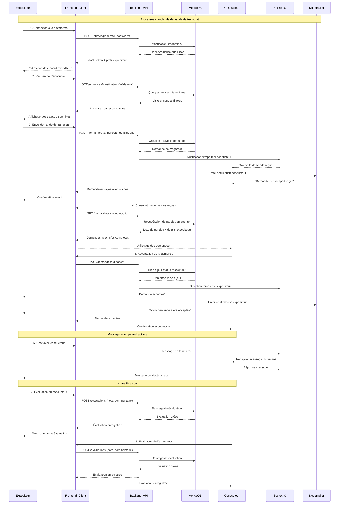
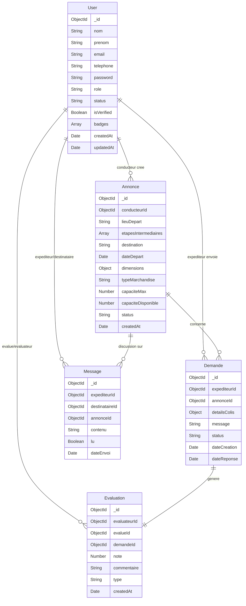

# TransportConnect 🚛

## 📋 Description du Projet

**TransportConnect** est une application web MERN (MongoDB, Express.js, React.js, Node.js) multi-rôles développée dans le cadre de ma formation à l'**École Numérique Ahmed Hensali**. Cette plateforme innovante facilite la logistique du transport de marchandises en connectant conducteurs et expéditeurs au sein d'un écosystème numérique sécurisé et efficace.

## 🎯 Objectifs du Projet

- **Digitaliser** le processus de transport de marchandises
- **Connecter** conducteurs et expéditeurs de manière efficace
- **Optimiser** la logistique du transport avec une solution moderne
- **Mettre en pratique** l'architecture MERN Stack complète
- **Implémenter** un système multi-rôles avec authentification sécurisée
- **Créer** une solution déployable en production avec Docker

## 👥 Rôles et Fonctionnalités

### 🚗 **Conducteur**
- ✅ Publication d'annonces de trajets détaillées
- ✅ Gestion des demandes reçues (acceptation/refus)
- ✅ Définition des critères de transport (dimensions, type de marchandise, capacité)
- ✅ Historique des trajets effectués
- ✅ Système d'évaluation des expéditeurs

### 📦 **Expéditeur**
- ✅ Recherche et filtrage des annonces disponibles
- ✅ Envoi de demandes de transport personnalisées
- ✅ Suivi des demandes et historique des envois
- ✅ Évaluation des conducteurs post-livraison
- ✅ Notifications en temps réel

### 🛠️ **Administrateur**
- ✅ Dashboard de gestion complet avec statistiques
- ✅ Gestion des utilisateurs (validation, suspension, badges)
- ✅ Modération des annonces et demandes
- ✅ Graphiques analytiques avec **react-chartjs-2**
- ✅ Supervision globale de la plateforme

## 🏗️ Architecture Technique

### **Backend Structure**
```
Server/
├── config/
│   ├── database.js          # Configuration MongoDB
│   └── jwt.js              # Configuration JWT
├── controllers/
│   ├── adminController.js   # Gestion admin
│   ├── annonceController.js # Gestion annonces
│   ├── authController.js    # Authentification
│   ├── demandeController.js # Gestion demandes
│   ├── evaluationController.js # Système d'évaluation
│   └── userController.js    # Gestion utilisateurs
├── middleware/
│   ├── auth.js             # Middleware d'authentification
│   ├── roleCheck.js        # Vérification des rôles
│   └── validation.js       # Validation des données
├── models/
│   ├── Annonce.js          # Modèle annonces
│   ├── Demande.js          # Modèle demandes
│   ├── Evaluation.js       # Modèle évaluations
│   ├── Message.js          # Modèle messagerie
│   └── User.js             # Modèle utilisateurs
├── routes/
│   ├── admin.js            # Routes administrateur
│   ├── annonces.js         # Routes annonces
│   ├── auth.js             # Routes authentification
│   ├── demandes.js         # Routes demandes
│   ├── evaluations.js      # Routes évaluations
│   ├── messages.js         # Routes messagerie
│   └── users.js            # Routes utilisateurs
└── server.js               # Point d'entrée serveur
```

### **Frontend Structure**
```
Client/
├── src/
│   ├── components/
│   │   ├── admin/          # Composants administrateur
│   │   ├── annonces/       # Composants annonces
│   │   ├── auth/           # Composants authentification
│   │   ├── chat/           # Composants messagerie
│   │   ├── common/         # Composants partagés
│   │   ├── demandes/       # Composants demandes
│   │   └── evaluations/    # Composants évaluations
│   ├── context/
│   │   ├── AuthContext.jsx # Context d'authentification
│   │   └── SocketContext.jsx # Context Socket.IO
│   ├── hooks/
│   │   ├── useApi.js       # Hook API personnalisé
│   │   ├── useAuth.js      # Hook authentification
│   │   └── useSocket.js    # Hook Socket.IO
│   ├── pages/
│   │   ├── Admin.jsx       # Page administrateur
│   │   ├── Annonces.jsx    # Page annonces
│   │   ├── Dashboard.jsx   # Tableau de bord
│   │   ├── Demandes.jsx    # Page demandes
│   │   ├── Home.jsx        # Page d'accueil
│   │   ├── MyAnnonces.jsx  # Mes annonces
│   │   └── Profile.jsx     # Profil utilisateur
│   └── utils/
│       ├── api.js          # Configuration Axios
│       ├── constants.js    # Constantes globales
│       └── helpers.js      # Fonctions utilitaires
```

## 🚀 Technologies Utilisées

### **Backend**
- **Node.js** - Runtime JavaScript
- **Express.js** - Framework web
- **MongoDB** - Base de données NoSQL
- **Mongoose** - ODM pour MongoDB
- **JWT** - Authentification sécurisée
- **Bcrypt** - Hachage des mots de passe
- **Socket.IO** - Communication temps réel
- **Nodemailer** - Envoi d'emails
- **Express-validator** - Validation des données

### **Frontend**
- **React.js** - Bibliothèque UI
- **React Router** - Navigation
- **Tailwind CSS** - Framework CSS
- **Axios** - Client HTTP
- **React Hook Form** - Gestion des formulaires
- **React-chartjs-2** - Graphiques et statistiques
- **Socket.IO Client** - Communication temps réel

### **DevOps & Déploiement**
- **Docker** - Conteneurisation
- **Docker Compose** - Orchestration multi-conteneurs
- **Nginx** - Serveur web et proxy inverse
- **PM2** - Gestionnaire de processus Node.js
- **Jenkins** - CI/CD Pipeline

## ⚡ Fonctionnalités Avancées

### 🔒 **Sécurité**
- Authentification JWT robuste
- Hachage des mots de passe avec Bcrypt
- Validation des données côté serveur
- Protection CORS configurée
- Middleware de vérification des rôles

### 💬 **Messagerie Temps Réel (BONUS)**
- Chat en direct entre conducteur et expéditeur
- Notifications push instantanées
- Interface de messagerie réactive
- Historique des conversations

### 📊 **Analytics & Reporting**
- Dashboard administrateur avec KPIs
- Graphiques interactifs (react-chartjs-2)
- Statistiques des utilisateurs actifs
- Taux d'acceptation des demandes
- Métriques de performance

## 🛠️ Installation et Configuration

### **Prérequis**
- Node.js (v16+)
- MongoDB (local ou Atlas)
- Docker & Docker Compose (optionnel)
- Git

### **Installation Locale**

1. **Cloner le repository**
```bash
git clone https://github.com/votre-username/transportconnect.git
cd transportconnect
```

2. **Configuration Backend**
```bash
cd server
npm install
```

Créer le fichier `.env` :
```env
PORT=5000
MONGODB_URI=mongodb://localhost:27017/transportconnect
JWT_SECRET=votre_jwt_secret_super_securise
JWT_EXPIRE=7d
EMAIL_USER=votre_email@gmail.com
EMAIL_PASS=votre_mot_de_passe_app
NODE_ENV=development
```

3. **Configuration Frontend**
```bash
cd ../client
npm install
```

Créer le fichier `.env` :
```env
REACT_APP_API_URL=http://localhost:5000/api
REACT_APP_SOCKET_URL=http://localhost:5000
```

4. **Lancement de l'application**
```bash
# Terminal 1 - Backend
cd server
npm run dev

# Terminal 2 - Frontend
cd client
npm start
```

### **Déploiement avec Docker**

```bash
# Construire et lancer les conteneurs
docker-compose up --build

# En arrière-plan
docker-compose up -d --build
```

## 📱 Utilisation de l'Application

### **Pour les Conducteurs**
1. Inscription/Connexion avec le rôle "Conducteur"
2. Création d'annonces avec détails du trajet
3. Gestion des demandes reçues
4. Suivi des livraisons et évaluations

### **Pour les Expéditeurs**
1. Inscription/Connexion avec le rôle "Expéditeur"
2. Recherche d'annonces selon critères
3. Envoi de demandes personnalisées
4. Suivi en temps réel et évaluations

### **Pour les Administrateurs**
1. Accès au dashboard de gestion
2. Modération des utilisateurs et contenus
3. Consultation des statistiques
4. Gestion des badges et validations

## 📊 Diagrammes de Conception

### **Diagramme de Séquence - Flux d'Interactions**

<details>
<summary>🔍 Voir le diagramme de séquence</summary>



</details>

*Ce diagramme détaille les interactions séquentielles entre les différents composants du système lors des opérations principales (authentification, création d'annonces, gestion des demandes).*

### **Diagramme de Classes - Modèle de Données**

<details>
<summary>🔍 Voir le diagramme de classes</summary>



</details>

*Architecture orientée objet montrant les entités principales du système avec leurs attributs, méthodes et relations. Inclut les classes User, Annonce, Demande, Evaluation et Message avec leurs associations.*

### **Diagramme de Cas d'Utilisation - Vue Fonctionnelle**

```mermaid
flowchart TD
    subgraph "👤 Conducteur"
        C1[S'inscrire/Se connecter]
        C2[Publier une annonce]
        C3[Gérer les demandes]
        C4[Accepter/Refuser demandes]
        C5[Consulter historique]
        C6[Évaluer expéditeurs]
        C7[Messagerie temps réel]
    end

    subgraph "📦 Expéditeur"
        E1[S'inscrire/Se connecter]
        E2[Rechercher annonces]
        E3[Filtrer par critères]
        E4[Envoyer demande]
        E5[Suivre mes demandes]
        E6[Évaluer conducteurs]
        E7[Chat avec conducteur]
    end

    subgraph "⚙️ Administrateur"
        A1[Accéder au dashboard]
        A2[Gérer utilisateurs]
        A3[Valider/Suspendre comptes]
        A4[Attribuer badges]
        A5[Modérer annonces]
        A6[Consulter statistiques]
        A7[Gérer les rapports]
    end

    subgraph "🔧 Système TransportConnect"
        SYS[Base de données MongoDB]
        AUTH[Authentification JWT]
        NOTIF[Notifications email]
        SOCKET[Messagerie temps réel]
        API[API RESTful]
    end

    C1 --> AUTH
    C2 --> API
    C3 --> API
    C7 --> SOCKET
    
    E1 --> AUTH
    E2 --> API
    E4 --> API
    E7 --> SOCKET
    
    A1 --> AUTH
    A2 --> API
    A6 --> API
    
    AUTH --> SYS
    API --> SYS
    NOTIF --> SYS
    SOCKET --> SYS
```

<details>
<summary>🔍 Voir le diagramme de cas d'utilisation</summary>



</details>

*Vue d'ensemble des fonctionnalités accessibles à chaque type d'acteur (Conducteur, Expéditeur, Administrateur) et leurs interactions avec le système TransportConnect.*

**Acteurs principaux :**
- **👤 Conducteur** : Publication d'annonces, gestion des demandes, évaluations
- **📦 Expéditeur** : Recherche de trajets, envoi de demandes, suivi des livraisons  
- **⚙️ Administrateur** : Gestion globale, statistiques, modération, validation des utilisateurs

**Fonctionnalités clés :**
- 🔐 Système d'authentification multi-rôles
- 📝 Gestion complète des annonces de transport
- 💬 Messagerie temps réel entre utilisateurs
- 📊 Dashboard administrateur avec analytics
- ⭐ Système d'évaluation bidirectionnel

## 📸 Captures d'Écran

*[Ici, vous pourriez ajouter des captures d'écran de votre application]*

## 🧪 Tests et Qualité

- Tests unitaires avec Jest
- Tests d'intégration API
- Validation des formulaires
- Gestion d'erreurs robuste
- Logs structurés

## 🚀 Déploiement en Production

### **Pipeline CI/CD avec Jenkins**
1. Tests automatisés
2. Build des images Docker
3. Déploiement automatisé
4. Monitoring et alertes

### **Configuration Nginx**
- Reverse proxy configuré
- Gestion SSL/TLS
- Compression gzip
- Cache statique optimisé

## 🎓 Contexte Académique

Ce projet **TransportConnect** a été conçu et développé dans le cadre d'un **jury blanc** de la formation à l'**École Numérique Ahmed Hensali**. Il constitue une évaluation pratique des compétences acquises en développement full-stack et démontre la maîtrise de l'écosystème technologique moderne.

### **Objectifs du Jury Blanc**
- ✅ **Évaluation des compétences** en développement MERN Stack
- ✅ **Démonstration** de la capacité à livrer une solution complète
- ✅ **Validation** des acquis en architecture logicielle
- ✅ **Préparation** au jury final de certification

## 🎯 Compétences Démontrées

### **Développement Backend**
- Conception d'API RESTful avec Express.js
- Modélisation de données avec MongoDB/Mongoose
- Authentification sécurisée avec JWT
- Architecture modulaire et middleware

### **Développement Frontend**
- Applications React.js modernes et responsives
- Gestion d'état complexe avec Context API
- Intégration d'APIs et communication temps réel
- Design système avec Tailwind CSS

### **DevOps et Déploiement**
- Conteneurisation avec Docker
- Configuration de serveurs avec Nginx
- Pipeline CI/CD avec Jenkins
- Gestion de processus avec PM2

### **Méthodologies**
- Architecture en couches (MVC)
- Développement orienté composants
- Tests et validation de code
- Documentation technique complète

## 📞 Contact

**Candidat** : [Votre Nom]  
**Formation** : École Numérique Ahmed Hensali  
**Type d'évaluation** : Jury Blanc - Projet Full-Stack  
**Email** : [votre.email@exemple.com]  
**LinkedIn** : [Votre profil LinkedIn]  

## 📄 Évaluation

Ce projet fait partie de l'évaluation continue de la formation à l'École Numérique Ahmed Hensali et sera présenté devant un jury composé de professionnels du secteur pour validation des compétences acquises.

---

*Projet de jury blanc - École Numérique Ahmed Hensali* 🎓
